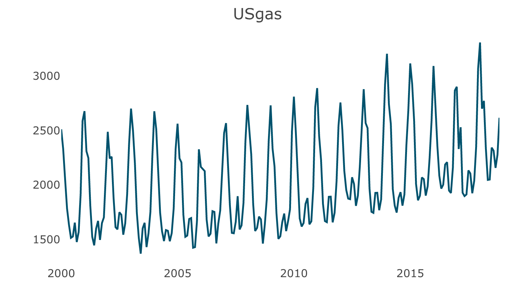
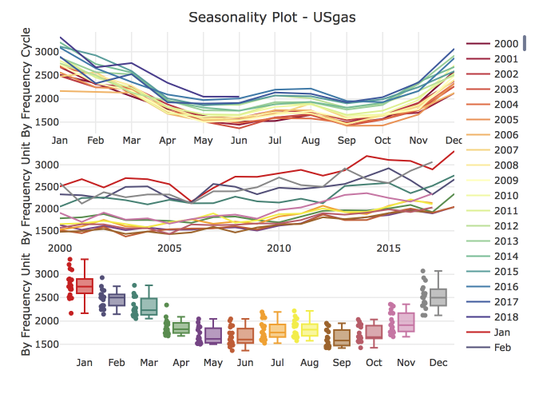
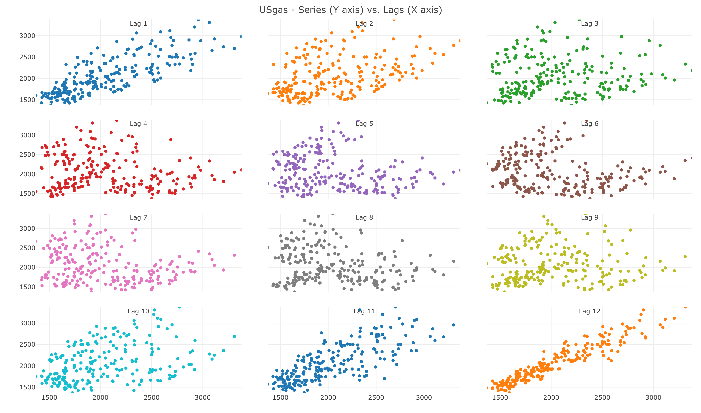
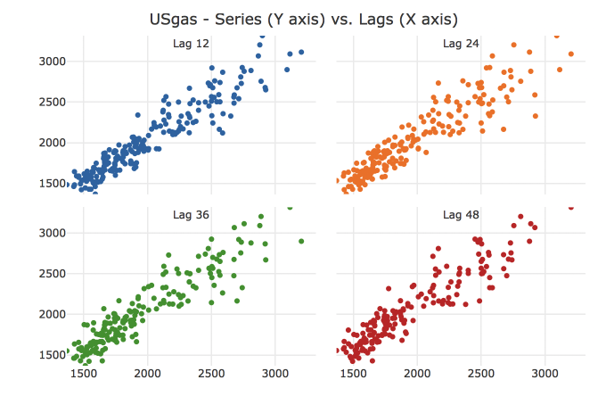
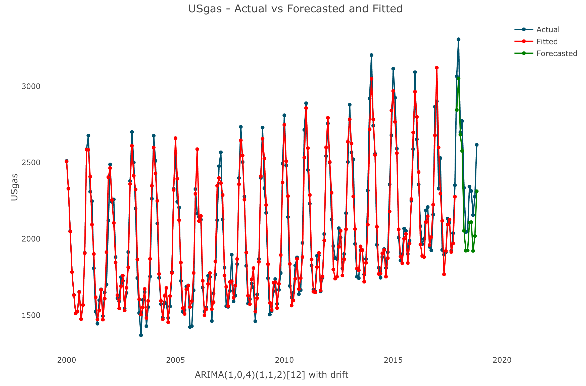
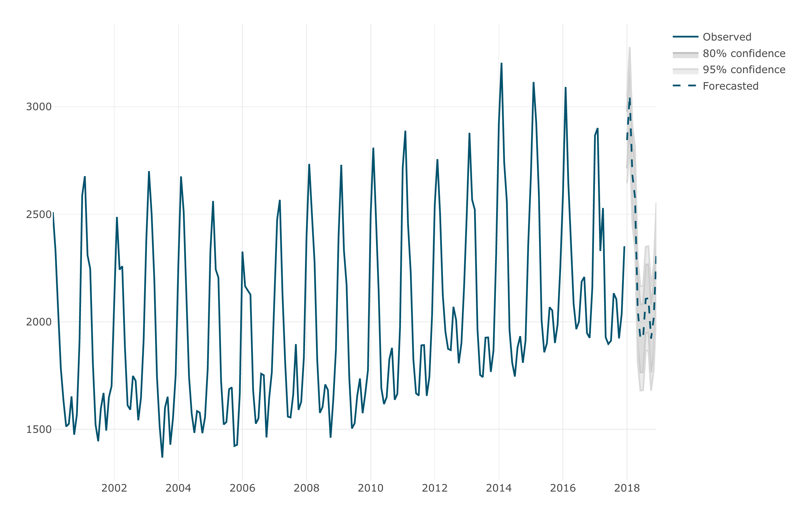
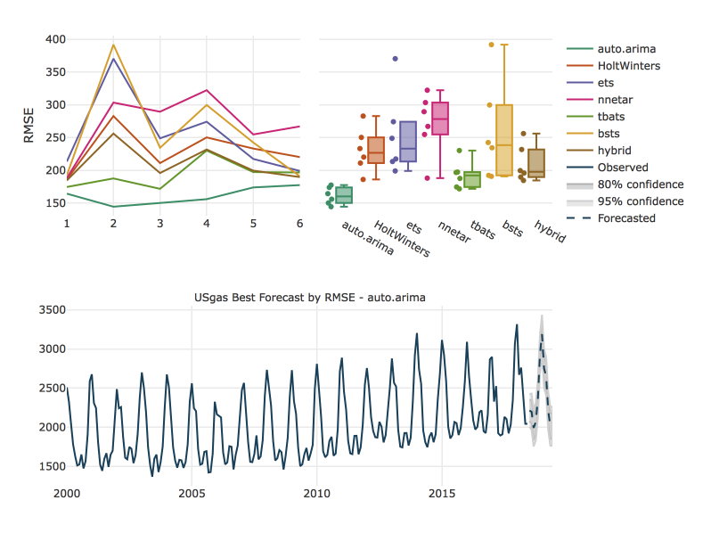

<!-- badges: start -->

[](https://cran.r-project.org/package=TSstudio)
[](https://cran.r-project.org/package=TSstudio)
[](https://www.tidyverse.org/lifecycle/#maturing)

<!-- badges: end -->

TSstudio
========

The [TSstudio](https://ramikrispin.github.io/TSstudio) package provides a set of tools descriptive and predictive analysis of time series data. That includes utility functions for preprocessing time series data,  interactive visualization functions based on the [plotly](https://CRAN.R-project.org/package=plotly) package engine, and set of tools for training and evaluating time series forecasting models from the [forecast](https://CRAN.R-project.org/package=forecast), [forecastHybrid](https://CRAN.R-project.org/package=forecastHybrid), and [bsts](https://CRAN.R-project.org/package=bsts) packages.

More information available on the package [vignettes](https://ramikrispin.github.io/TSstudio/articles/).


Installation
------------

Install the stable version from [CRAN](https://CRAN.R-project.org/package=TSstudio):

``` r
install.packages("TSstudio")
```

or install the development version from [Github](https://github.com/RamiKrispin/TSstudio):

``` r
# install.packages("devtools")
devtools::install_github("RamiKrispin/TSstudio")
```


Usage
-----
``` r
library(TSstudio)
data(USgas)

# Ploting time series object
ts_plot(USgas, 
        title = "US Monthly Natural Gas Consumption",
        Ytitle = "Billion Cubic Feet")
```
 
``` r
# Seasonal plot
ts_seasonal(USgas, type = "all")
```

``` r
# Lags plot
ts_lags(USgas, lags = 1:12)
```

``` r
# Seasonal lags plot
ts_lags(USgas, lags = c(12, 24, 36, 48))
```

``` r
# Heatmap plot
ts_heatmap(USgas)
```

``` r
# Forecasting applications
# Setting training and testing partitions
USgas_s <- ts_split(ts.obj = USgas, sample.out = 12)
train <- USgas_s$train
test <- USgas_s$test

# Forecasting with auto.arima
library(forecast)
md <- auto.arima(train)
fc <- forecast(md, h = 12)

# Plotting actual vs. fitted and forecasted
test_forecast(actual = USgas, forecast.obj = fc, test = test)
```

``` r
# Plotting the forecast 
plot_forecast(fc)
```

``` r
# Forecasting with backtesting 
USgas_backtesting <- ts_backtesting(USgas, 
                                    models = "abehntw", 
                                    periods = 6, 
                                    error = "RMSE", 
                                    window_size = 12, 
                                    h = 12)


```




``` r
hw_grid <- ts_grid(USgas, 
                   model = "HoltWinters",
                   periods = 6,
                   window_space = 6,
                   window_test = 12,
                   hyper_params = list(alpha = seq(0,1,0.1),
                                       beta = seq(0,1,0.1),
                                       gamma = seq(0,1,0.1)))
                                       
plot_grid(hw_grid, type = "3D")
```

