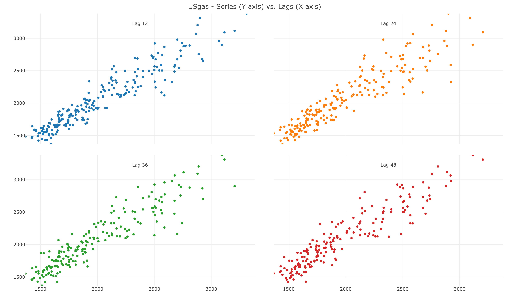
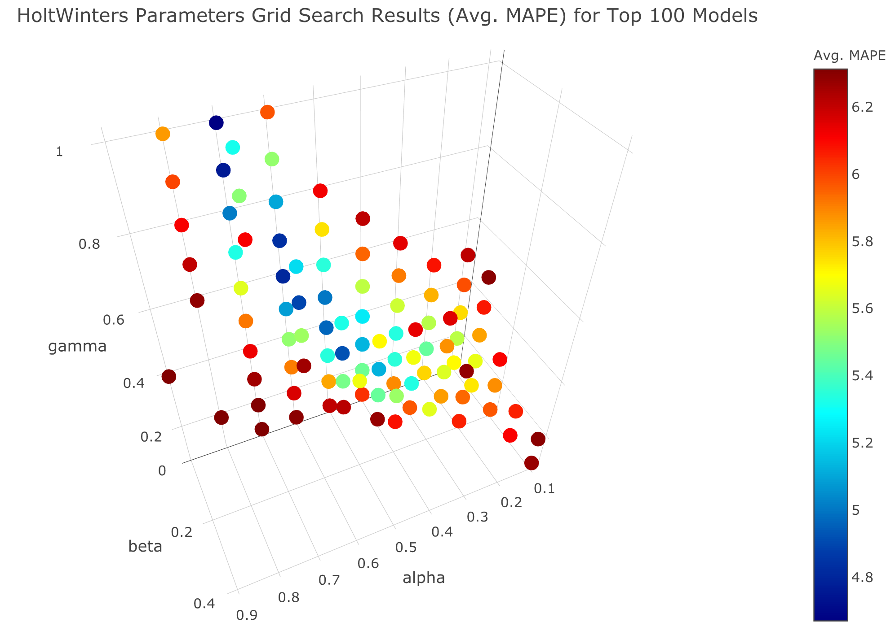

<!-- badges: start -->

[](https://cran.r-project.org/package=TSstudio)
[](https://cran.r-project.org/package=TSstudio)
[](https://www.tidyverse.org/lifecycle/#maturing)

<!-- badges: end -->

TSstudio
========

The [TSstudio](https://ramikrispin.github.io/TSstudio) package provides a set of tools descriptive and predictive analysis of time series data. That includes utility functions for preprocessing time series data,  interactive visualization functions based on the [plotly](https://CRAN.R-project.org/package=plotly) package engine, and set of tools for training and evaluating time series forecasting models from the [forecast](https://CRAN.R-project.org/package=forecast), [forecastHybrid](https://CRAN.R-project.org/package=forecastHybrid), and [bsts](https://CRAN.R-project.org/package=bsts) packages.

More information available on the package [vignettes](https://ramikrispin.github.io/TSstudio/articles/).


Installation
------------

Install the stable version from [CRAN](https://CRAN.R-project.org/package=TSstudio):

``` r
install.packages("TSstudio")
```

or install the development version from [Github](https://github.com/RamiKrispin/TSstudio):

``` r
# install.packages("devtools")
devtools::install_github("RamiKrispin/TSstudio")
```


Usage
-----

### Plotting time series data

``` r
library(TSstudio)
data(USgas)

# Ploting time series object
ts_plot(USgas, 
        title = "US Monthly Natural Gas Consumption",
        Ytitle = "Billion Cubic Feet")
```


### Seasonality analysis
``` r
# Seasonal plot
ts_seasonal(USgas, type = "all")
```

``` r
# Heatmap plot
ts_heatmap(USgas)
```


### Correlation analysis

``` r
# ACF and PACF plots
ts_cor(USgas, lag.max = 60)
```


``` r
# Lags plot
ts_lags(USgas, lags = 1:12)
```


``` r
# Seasonal lags plot
ts_lags(USgas, lags = c(12, 24, 36, 48))
```


### Training forecasting models

``` r
# Forecasting applications
# Setting training and testing partitions
USgas_s <- ts_split(ts.obj = USgas, sample.out = 12)
train <- USgas_s$train
test <- USgas_s$test

# Forecasting with auto.arima
library(forecast)
md <- auto.arima(train)
fc <- forecast(md, h = 12)

# Plotting actual vs. fitted and forecasted
test_forecast(actual = USgas, forecast.obj = fc, test = test)
```


``` r
# Plotting the forecast 
plot_forecast(fc)
```


``` r
# Run horse race between multiple models
methods <- list(ets1 = list(method = "ets",
                            method_arg = list(opt.crit = "lik"),
                            notes = "ETS model with opt.crit = lik"),
                ets2 = list(method = "ets",
                            method_arg = list(opt.crit = "amse"),
                            notes = "ETS model with opt.crit = amse"),
                arima1 = list(method = "arima",
                              method_arg = list(order = c(2,1,0)),
                              notes = "ARIMA(2,1,0)"),
                arima2 = list(method = "arima",
                              method_arg = list(order = c(2,1,2),
                                                seasonal = list(order = c(1,1,1))),
                              notes = "SARIMA(2,1,2)(1,1,1)"),
                hw = list(method = "HoltWinters",
                          method_arg = NULL,
                          notes = "HoltWinters Model"),
                tslm = list(method = "tslm",
                            method_arg = list(formula = input ~ trend + season),
                            notes = "tslm model with trend and seasonal components"))
# Training the models with backtesting
md <- train_model(input = USgas,
                  methods = methods,
                  train_method = list(partitions = 6, 
                                      sample.out = 12, 
                                      space = 3),
                  horizon = 12,
                  error = "MAPE")
# A tibble: 6 x 7
  model_id model       notes                                         avg_mape avg_rmse `avg_coverage_80%` `avg_coverage_95%`
  <chr>    <chr>       <chr>                                            <dbl>    <dbl>              <dbl>              <dbl>
1 arima2   arima       SARIMA(2,1,2)(1,1,1)                            0.0557     167.              0.583              0.806
2 hw       HoltWinters HoltWinters Model                               0.0563     163.              0.736              0.889
3 ets1     ets         ETS model with opt.crit = lik                   0.0611     172.              0.681              0.903
4 ets2     ets         ETS model with opt.crit = amse                  0.0666     186.              0.458              0.833
5 tslm     tslm        tslm model with trend and seasonal components   0.0767     220.              0.417              0.667
6 arima1   arima       ARIMA(2,1,0)                                    0.188      598.              0.875              0.958

```


``` r
# Plot the performance of the different models on the testing partitions
plot_model(md)
```


``` r
# Holt-Winters tunning parameters with grid search
hw_grid <- ts_grid(USgas, 
                   model = "HoltWinters",
                   periods = 6,
                   window_space = 6,
                   window_test = 12,
                   hyper_params = list(alpha = seq(0,1,0.1),
                                       beta = seq(0,1,0.1),
                                       gamma = seq(0,1,0.1)))
                                       
plot_grid(hw_grid, type = "3D")
```



