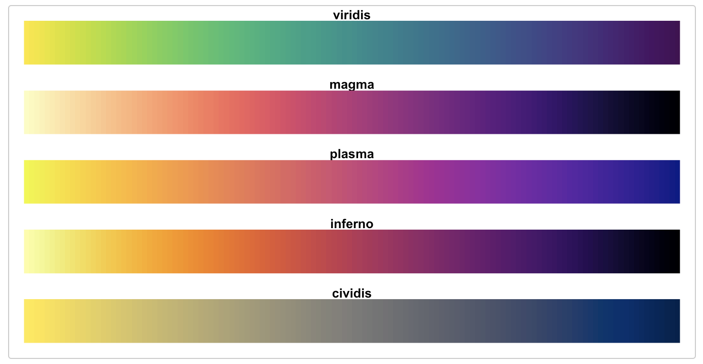

```{r setup, include=FALSE}
knitr::opts_chunk$set(echo = TRUE)
options(list(menu.graphics = FALSE, scipen=99, digits= 3))
```
### Seasonality analysis

The TSstudio provides a variety of functions for seasonality analysis, with the use of interactive data visualizations tools such as seasonal, heatmap, quantile, surface and polar plots, based on the [plotly](https://plot.ly/r/) package engine. Most of those functions support the main time series classes  ("ts", "xts" and "zoo" objects, and as well data frame objects "data.frame", "data.table" and "tbl") with a frequency between daily and quarterly (with the exception of the quantile plot, which support half-hour and hourly frequencies).

```{r}
# install.packages("TSstudio")
library(TSstudio)
packageVersion("TSstudio")
```


#### The USgas dataset

In the following examples, we will use the USgas dataset. This dataset is one of the TSstudio package datasets, and a good example of a time series with a strong seasonal pattern. This dataset represents the monthly natural gas consumption in the US since 2000:

```{r fig.height=5, fig.width= 10, message=FALSE, warning=FALSE}
# Load the US monthly natural gas consumption
library(TSstudio)
data("USgas")

class(USgas)

ts_plot(USgas,
        title = "US Natural Gas Consumption",
        Xtitle = "Year",
        Ytitle = "Billion Cubic Feet"
        )

```


#### The ts_seasonal function

The ts_seasonal function was designed for plotting time series data by its full frequency cycle (hence, hence break the series by years for monthly data) and/or by its frequency units (e.g., by the months of the year for monthly data). The function supports "ts", "xts", "zoo" and data frame family objects with a frequency between daily to quarterly. The function has three modes (and a fourth one that includes all the three modes together): 

1. "normal" - type provides a break of the series by the cycle units (or years). This allows identifying whether the series has a reputable seasonal pattern: 

```{r fig.height=5, fig.width= 10, message=FALSE, warning=FALSE}
ts_seasonal(USgas, type = "normal")

```
The colors are being set automatically by a sequential color palette in chronical order.

2. "cycle" - this option provides a view of each frequency unit of the series across the full cycle units of the frequency, in the example below you can notice, for example, that the consumption during January in most of the years was the peak of the year:

```{r fig.height=5, fig.width= 10, message=FALSE, warning=FALSE}
ts_seasonal(USgas, type = "cycle")
```

3. "box" - for representing the cycle units with a box plot:

```{r fig.height=5, fig.width= 10, message=FALSE, warning=FALSE}
ts_seasonal(USgas, type = "box")
```


Alternatively, setting the type = “all”, print the three options above together in one plot:

```{r fig.height=5, fig.width= 10, message=FALSE, warning=FALSE}
ts_seasonal(USgas, type = "all")
```

Note: that the colors of the months in the "cycle" plot corresponding to the colors in the "box" plot. 

While the "box" mode provides a useful information about the distribution of each frequency units, it might be misleading as the series was not detrended. Similarly, the "cycle" represents the variation and trend, if exists, of each frequency unit over time, yet it is hard to identify the distribution. The "all" mode provides the full picture, as it is allowed to identify a seasonal pattern within the series without detrending it.

#### Colors setting

The colors of the plots can be modified to any of the RColorBrewer or viridis packages palettes options (see below the available palettes). The "palette_normal" arguments set the colors of the "normal" mode. As mentioned above, colors set according to the chronological order of the lines. The "palette" argument set the colors of the both the "cycle" and "box" options. In the example below, the colors of the "normal" plot are set to "inferno" palette from the viridis package and the "cycle" and "box" plots are set to "Accent" palette from the RColorBrewer package. 


```{r fig.height=5, fig.width= 10, message=FALSE, warning=FALSE}
ts_seasonal(USgas, type = "all", palette_normal = "inferno", palette = "Accent")
```

Below are the possible palettes of the RColorBrewer and viridis packages:

```{r fig.height=8, fig.width= 10, message=FALSE, warning=FALSE}
RColorBrewer::display.brewer.all() 
```




#### The ts_heatmap function

Another useful visualization tool for seasonality analysis is the ts_heatmap function for time series objects, where the y axis represents the cycle units and x axis represents the years:

```{r fig.height=5, fig.width= 10, message=FALSE, warning=FALSE}
ts_heatmap(USgas)
```

Likewise the ts_seasonal function, the heatmap colors can be set by any of the palettes in the RColorBrewer and viridis packages with the "color" argument: 

```{r fig.height=5, fig.width= 10, message=FALSE, warning=FALSE}
ts_heatmap(USgas, color = "Reds")
```

One of the main improvement in the current version is the ability to handle daily and weekly frequencies in addition to the monthly and quarterly. By default, daily data (whenever it has "Date" index) will appear in a format of weekday by year. For example, we will plot the daily demand for electricity in the UK (available in the UKgrid package):

```{r fig.height=10, fig.width= 10, message=FALSE, warning=FALSE}
#install_github("RamiKrispin/UKgrid")
library(UKgrid)

UKgrid_daily <- extract_grid(type = "tbl", aggregate = "daily")
head(UKgrid_daily)

ts_heatmap(UKgrid_daily, color = "BuPu")
```

#### Surface and polar plots

The ts_surface function provides a 3D representative for time series data 

```{r fig.height=5, fig.width= 10, message=FALSE, warning=FALSE}
ts_surface(USgas)
```

The ts_polar function provides a polar plot demonstrative of time series data where the year is represented by color and the magnitude is represented by the size of the cycle unit layer:
```{r fig.height=5, fig.width= 10, message=FALSE, warning=FALSE}
ts_polar(USgas)
```

#### Correlation Analysis

The ts_lag, as the name implies, create a lag plot of time series data currently support only "ts", "xts", and "zoo" objects with monthly or quarterly frequency:

```{r fig.height=5, fig.width= 10, message=FALSE, warning=FALSE}
ts_lags(USgas)
```

By default, it plots the last 12 lags, however the namber of lag can be modify with the "lag.max" argument:

```{r fig.height=10, fig.width= 10, message=FALSE, warning=FALSE}
ts_lags(USgas, lag.max = 24)
```

The ts_acf and ts_pacf are wrappers for the stats package acf and pacf functions, providing a colorful and interactive version for those functions:

```{r, fig.height=5, fig.width= 10, message=FALSE, warning=FALSE}
ts_acf(USgas, lag.max = 36)
ts_pacf(USgas, lag.max = 36)

```

